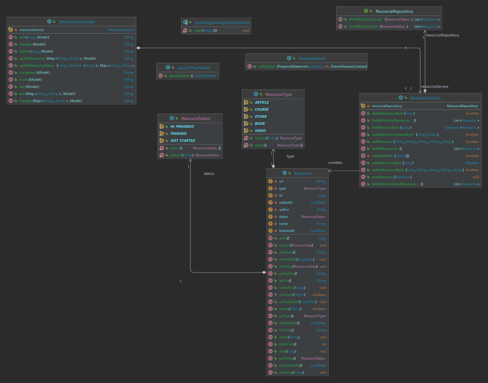
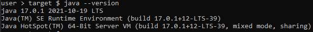
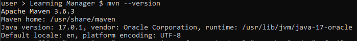
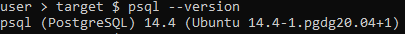
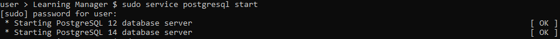
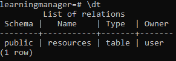
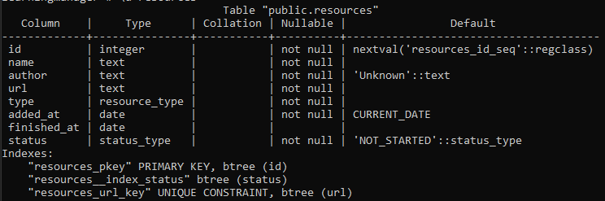

# Learning Manager
#### Video Demo:  <URL HERE>
#### Description:
'Learning Manager' is a web application built to let you manage 
the resources (videos, articles, courses, books and others) of 
your knowledge so that they can be referenced in the future on your
notes or articles.

Its a must for any Personal Knowledge Management System, it can
help you keep track of the different stages you may be in a specific
resource.

Built on a Layered Architecture following MVC and using:
- PostgreSQL
- Java - Spring Framework
  - Spring Boot
  - Spring Data JPA
  - Maven
  - Lombok
- Thymeleaf
- HTML
- CSS
- Bootstrap
- JavaScript

Class Diagram:


Requirements for deployment:
- Java 17 (or superior)
- Maven 3.6.3 (or superior)
- PostgreSQL 14

Instructions:
1. Download ZIP of the Project
2. Extract ZIP in an empty folder
3. Open a terminal and navigate to the project's folder
4. Execute ```./mvnw package``` to build the JAR
5. Locate JAR inside folder ```target```
6. Run the JAR using ```java -jar <JARNAME>``` in terminal
7. Open the web app in your browser ```http://localhost:8080/```

Troubleshooting:
- Ensure you have java installed using ```java --version```:


- Ensure you have maven installed using ```mvn --version```:


- Ensure you have PostgreSQL installed using ```psql --version```


- Ensure PostgreSQL service its running via ```sudo service postgresql start```:


- Ensure resources table exists in your database. 
  - First access Postgres via ```psql``` in terminal
  - Use command ```\dt``` to list all the tables in your current database

  


- Check your table "resources" its ok using ```\d resources```
